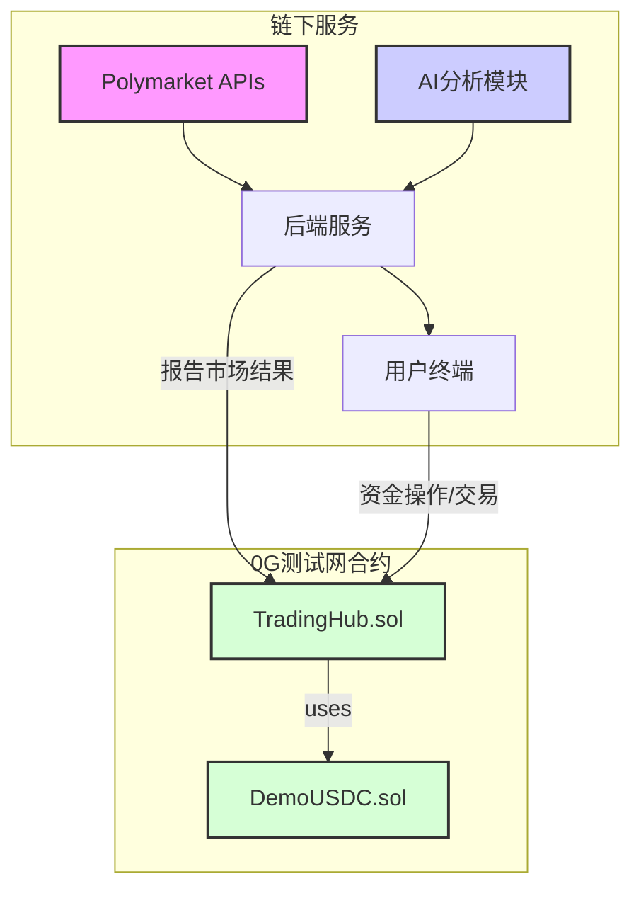

# 预测市场聚合交易终端 - 产品需求文档 (PRD)

| 文档版本 | 日期 | 作者 | 状态 |
| :--- | :--- | :--- | :--- |
| v1.0 | 2026-01-31 | Manus AI | 草稿 |

## 1. 项目概述

### 1.1. 项目目标

本项目旨在开发一个基于0G测试网的预测市场聚合交易终端Demo。该产品将聚合来自Polymarket的预测事件数据，并利用0G的AI能力为用户提供决策辅助，同时在0G测试网上提供一个完整的、模拟的链上交易体验。产品核心是“链下数据聚合 + 链上模拟交易”的混合架构。

### 1.2. 核心功能

*   **市场浏览**: 从Polymarket API实时获取并展示活跃的预测市场事件。
*   **AI分析**: 对指定的市场事件，调用0G AI模型进行信源分析和结果预测。
*   **链上钱包**: 用户可在0G测试网上进行模拟USDC的充值和提现。
*   **模拟交易**: 用户可在0G测试网上对聚合来的Polymarket市场进行模拟下单、撮合和结算。

### 1.3. 团队角色与分工

| 角色 | 负责人 | 主要职责 |
| :--- | :--- | :--- |
| **合约开发** | 成员A | 负责0G测试网上`DemoUSDC`和`TradingHub`智能合约的编写、测试和部署。 |
| **AI分析** | 成员B | 负责AI分析模块的开发，包括对接0G AI模型、设计Prompts和实现分析流程。 |
| **前端开发** | 成员C | 负责用户界面的开发，包括市场展示、AI结果呈现、钱包交互和交易操作。 |
| **后端开发** | 成员D | 负责Polymarket数据同步、作为预言机向链上报告结果，并为前端和AI模块提供API接口。 |

## 2. 系统架构



## 3. 用户故事 (User Stories)

*   **As a User**, I want to browse a list of active prediction markets from Polymarket, so that I can find interesting events to trade.
*   **As a User**, I want to view the detailed order book for a specific market, so that I can understand its liquidity and price distribution.
*   **As a User**, I want to request an AI analysis for a market, so that I can get an AI-powered prediction and confidence score to help my decision.
*   **As a User**, I want to connect my wallet to the platform, so that I can interact with the 0G testnet.
*   **As a User**, I want to get free test USDC and deposit it into the platform's trading contract, so that I can start trading.
*   **As a User**, I want to place a buy or sell order (limit order) on a specific market outcome, so that I can execute my trading strategy.
*   **As a User**, I want to see my open orders and have the ability to cancel them, so that I can manage my orders.
*   **As a User**, I want to see my current positions (holdings of outcome tokens) and my USDC balance, so that I can track my portfolio.
*   **As a User**, when a market I traded in is resolved, I want to be able to redeem my winning tokens for USDC, so that I can realize my profit.
*   **As a User**, I want to withdraw my USDC from the platform back to my wallet, so that I can control my funds.

## 4. 开发规范 (待补充)

### 4.1. 智能合约开发 (负责人: 成员A)

#### 4.1.1. 技术栈

- **语言**: Solidity ^0.8.20
- **开发框架**: Hardhat / Foundry
- **标准**: ERC20, ERC1155
- **依赖库**: OpenZeppelin Contracts

#### 4.1.2. 合约 `DemoUSDC.sol`

这是一个标准的ERC20代币合约，用于模拟USDC。

- **标准**: ERC20
- **名称**: DemoUSDC
- **符号**: dUSDC
- **小数位**: 6

**接口定义:**

```solidity
interface IDemoUSDC {
    // 标准ERC20函数
    function totalSupply() external view returns (uint256);
    function balanceOf(address account) external view returns (uint256);
    function transfer(address recipient, uint256 amount) external returns (bool);
    function allowance(address owner, address spender) external view returns (uint256);
    function approve(address spender, uint256 amount) external returns (bool);
    function transferFrom(address sender, address recipient, uint256 amount) external returns (bool);

    // Demo功能：允许任何人铸造测试币
    function mint(address to, uint256 amount) external;
}
```

#### 4.1.3. 合约 `TradingHub.sol`

这是系统的核心交易合约，处理所有金融逻辑。它将同时实现ERC1155标准来代表市场的“结果代币”。

**核心数据结构:**

```solidity
struct Order {
    uint256 id;          // 订单ID
    address owner;       // 订单所有者
    uint256 price;       // 价格 (1-99)
    uint256 amount;      // 剩余未成交数量
}

// 使用mapping实现订单簿，更节省gas
// mapping(marketId => mapping(price => mapping(orderId => Order)))

// 用户USDC余额
mapping(address => uint256) public userBalances;

// 市场解析结果
// 0: 未解析, 1: NO胜, 2: YES胜
mapping(bytes32 => uint8) public marketResolutions;
```

**结果代币 (ERC1155):**

- `tokenId` 将通过 `keccak256(abi.encodePacked(marketId, outcome))` 动态计算。
- `outcome`: `0` 代表 `NO`, `1` 代表 `YES`。

**接口定义:**

```solidity
interface ITradingHub {
    // --- 资金管理 --- 
    event Deposit(address indexed user, uint256 amount);
    event Withdraw(address indexed user, uint256 amount);

    function deposit(uint256 amount) external;
    function withdraw(uint256 amount) external;

    // --- 交易核心 --- 
    event OrderPlaced(address indexed user, bytes32 indexed marketId, uint256 orderId, uint8 outcome, uint256 price, uint256 amount);
    event OrderCancelled(address indexed user, bytes32 indexed marketId, uint256 orderId);
    event OrderMatched(bytes32 indexed marketId, uint256 price, uint256 amount, address indexed buyer, address indexed seller);

    function placeOrder(bytes32 marketId, uint8 outcome, uint256 price, uint256 amount) external returns (uint256 orderId);
    function cancelOrder(uint256 orderId) external;

    // --- 市场解析与结算 --- 
    event MarketResolved(bytes32 indexed marketId, uint8 winningOutcome);
    event Redemption(address indexed user, bytes32 indexed marketId, uint256 amount);

    // 只有合约所有者（后端服务）可以调用
    function resolveMarket(bytes32 marketId, uint8 winningOutcome) external;
    function redeem(bytes32 marketId) external;

    // --- 视图函数 --- 
    function getOrder(uint256 orderId) external view returns (Order memory);
    function getUserBalance(address user) external view returns (uint256);
    // ... 其他用于前端展示订单簿的视图函数
}
```

### 4.2. 后端服务开发 (负责人: 成员D)

后端服务是连接Polymarket数据、AI模块、前端和链上合约的中心枢纽。

#### 4.2.1. 技术栈

- **语言**: Python (Flask/FastAPI) 或 Node.js (Express)
- **Web3库**: Web3.py (Python) / Ethers.js (Node.js)
- **数据库**: PostgreSQL / MongoDB (可选，用于缓存和记录分析任务)

#### 4.2.2. 核心职责

1.  **数据同步**: 定时从Polymarket Gamma API拉取市场数据并缓存。
2.  **API网关**: 为前端提供统一的RESTful API接口，封装对Polymarket、AI模块和链上数据的访问。
3.  **预言机(Oracle)**: 监控Polymarket已解析的市场，并将结果安全地提交到`TradingHub.sol`合约。

#### 4.2.3. API接口定义

**Base URL**: `/api/v1`

**1. 获取市场列表**

- **Endpoint**: `GET /markets`
- **Description**: 从Polymarket获取并返回一个市场列表。
- **Query Params**:
    - `limit: int` (default: 20)
    - `offset: int` (default: 0)
    - `sortBy: string` (e.g., `volume`, `creationDate`, default: `volume`)
- **Success Response (200 OK)**:
    ```json
    {
        "data": [
            {
                "marketId": "0x...",
                "title": "Will Ethereum reach $5,000 by end of year?",
                "imageUrl": "https://...",
                "volume": 1250000.50,
                "endDate": "2026-12-31T23:59:59Z",
                "isResolved": false
            }
        ],
        "total": 150
    }
    ```

**2. 获取市场详情**

- **Endpoint**: `GET /markets/{marketId}`
- **Description**: 获取单个市场的详细信息，包括Polymarket的订单簿。
- **Path Params**: `marketId: string`
- **Success Response (200 OK)**:
    ```json
    {
        "marketId": "0x...",
        "title": "...",
        "description": "...",
        "resolutionSource": "https://...",
        "endDate": "...",
        "isResolved": false,
        "polymarketOrderBook": {
            "bids": [{"price": "55", "size": "1000"}],
            "asks": [{"price": "57", "size": "500"}]
        }
    }
    ```

**3. 请求AI分析**

- **Endpoint**: `POST /markets/{marketId}/analyze`
- **Description**: 为指定市场触发一个异步的AI分析任务。
- **Path Params**: `marketId: string`
- **Success Response (202 Accepted)**:
    ```json
    {
        "taskId": "a1b2c3d4-e5f6-7890-g1h2-i3j4k5l6m7n8"
    }
    ```

**4. 获取AI分析结果**

- **Endpoint**: `GET /analysis/{taskId}`
- **Description**: 根据任务ID查询AI分析的结果。
- **Path Params**: `taskId: string`
- **Success Response (200 OK)**:
    ```json
    {
        "taskId": "...",
        "status": "completed", // pending, processing, completed, failed
        "marketId": "0x...",
        "prediction": "YES", // YES, NO
        "confidence": 85, // 0-100
        "proArguments": [
            {"argument": "...", "confidence": 90},
            {"argument": "...", "confidence": 80}
        ],
        "conArguments": [
            {"argument": "...", "confidence": 60}
        ],
        "reasoning": "(Chain of Thought from LLM)..."
    }
    ```

#### 4.2.4. 预言机(Oracle)逻辑

- 后端需要一个定时任务（如Cron Job），每5分钟执行一次。
- 任务逻辑：
    1.  从Polymarket的`/events`接口获取最近已关闭（`closed=true`）且活跃（`active=false`）的市场。
    2.  检查这些市场在`TradingHub.sol`合约中的状态是否仍为“未解析”。
    3.  如果一个市场在Polymarket上已解析，但在链上未解析，则调用`TradingHub.sol`的`resolveMarket(marketId, winningOutcome)`函数。
    4.  调用时必须使用一个拥有合约`owner`权限的安全钱包地址，并处理好nonce和gas。

### 4.3. AI分析模块开发 (负责人: 成员B)

AI分析模块是一个独立的Python服务，它接收后端服务的请求，执行一系列分析，并将结果存入数据库供后端查询。

#### 4.3.1. 技术栈

- **语言**: Python 3.9+
- **AI调用**: `openai` Python库
- **网页抓取**: `requests`, `BeautifulSoup4`
- **任务队列 (可选)**: Celery, Redis (用于处理异步分析任务)

#### 4.3.2. 核心函数定义

```python
# ai_analyzer/main.py

def start_analysis_task(market_info: dict) -> str:
    """
    接收后端传来的市场信息，启动一个异步分析任务。
    
    Args:
        market_info (dict): 包含 title, description, resolutionSource 等信息的字典。
        
    Returns:
        str: 生成的唯一任务ID。
    """
    # 1. 生成任务ID，将任务状态初始化为 'pending' 并存入数据库
    # 2. (可选) 将任务推送到Celery队列
    # 3. 立即返回任务ID
    pass

async def run_analysis(task_id: str, market_info: dict):
    """
    执行完整的AI分析流程。
    """
    # 1. 更新任务状态为 'processing'
    # 2. 步骤一：信源检索
    article_text = await fetch_and_clean_source(market_info['resolutionSource'])
    
    # 3. 步骤二：多角度论证
    pro_args = await generate_arguments(market_info, article_text, is_pro=True)
    con_args = await generate_arguments(market_info, article_text, is_pro=False)
    
    # 4. 步骤三：综合判断
    final_prediction = await make_final_prediction(market_info, pro_args, con_args)
    
    # 5. 将所有结果（pro_args, con_args, final_prediction）存入数据库
    # 6. 更新任务状态为 'completed'
    pass
```

#### 4.3.3. Prompt设计 (关键！)

**1. 生成论据 (Pro/Con)**

```
System Prompt:
You are a professional prediction market analyst. Your goal is to provide clear, concise, and well-supported arguments based *only* on the provided source text. Do not use external knowledge.

User Prompt:
Based on the prediction market event and the source article below, generate exactly 3 independent arguments that support a 'YES' outcome. For each argument, provide a confidence score from 1 to 100.

Event Title: {market_info['title']}
Event Description: {market_info['description']}

Source Article Text:
---
{article_text}
---

Respond in JSON format: {"arguments": [{"argument": "...", "confidence": ...}]}}
```
*(生成反方论据时，将 'YES' 替换为 'NO')*

**2. 最终判断**

```
System Prompt:
You are a master prediction market decider. You will be given a set of pro and con arguments. Your task is to synthesize this information, perform a step-by-step reasoning process, and then make a final prediction (YES or NO) with an overall confidence score.

User Prompt:
Synthesize the following arguments to make a final prediction.

Event Title: {market_info['title']}

Pro Arguments:
- {pro_args[0]['argument']} (Confidence: {pro_args[0]['confidence']})
- {pro_args[1]['argument']} (Confidence: {pro_args[1]['confidence']})

Con Arguments:
- {con_args[0]['argument']} (Confidence: {con_args[0]['confidence']})
- {con_args[1]['argument']} (Confidence: {con_args[1]['confidence']})

First, provide your step-by-step reasoning (chain of thought). Then, provide the final answer in JSON format: {"prediction": "...", "confidence": ..., "reasoning": "..."}
```

#### 4.3.4. 与后端服务的交互

- AI模块通过一个简单的内部API（如Flask）接收后端服务`POST /markets/{marketId}/analyze`的请求。
- 请求体应包含进行分析所需的市场信息。
- AI模块处理完毕后，将结果写入共享的数据库（如PostgreSQL），后端服务通过查询该数据库的`analysis_results`表来获取结果。

### 4.4. 前端开发 (负责人: 成员C)

前端是用户与产品交互的唯一入口，需要提供清晰、流畅、响应迅速的体验。

#### 4.4.1. 技术栈

- **框架**: React (with Vite) 或 Vue.js
- **Web3库**: Ethers.js 或 Viem (推荐Viem，更现代、轻量)
- **UI库**: TailwindCSS (用于快速构建UI), Ant Design / Shadcn UI (组件库)
- **状态管理**: Redux Toolkit / Zustand (React) 或 Pinia (Vue)
- **数据请求**: `axios` 或 `react-query`

#### 4.4.2. 页面与核心组件

**1. 页面 (Pages)**

- **`/` (Home/Market List Page)**: 
    - 默认页面，展示从后端 `GET /markets` 获取的市场列表。
    - 支持分页、排序和筛选。
    - 每个市场项应简洁展示标题、图片、交易量，并有一个链接到详情页。
- **`/market/{marketId}` (Market Detail Page)**:
    - 页面核心，展示单个市场的详细信息。
    - **左侧**: 市场详情（标题、描述、结束时间）、Polymarket订单簿、链上订单簿（从`TradingHub`合约读取）。
    - **右侧**: 交易面板（下单组件）、AI分析面板。
- **`/portfolio` (Portfolio Page)**:
    - 展示用户的资产信息。
    - 显示链上USDC余额、`TradingHub`合约中的USDC余额。
    - 显示用户在各个市场的结果代币持仓（ERC1155余额）。
    - 显示用户在`TradingHub`中的所有活动订单，并提供取消功能。

**2. 核心组件 (Components)**

- **`Header`**: 
    - 包含Logo、导航链接（Markets, Portfolio）。
    - **`WalletConnectButton`**: 核心组件，处理连接钱包（如MetaMask）的逻辑。显示“Connect Wallet”或用户的地址和余额。
- **`MarketCard`**: 在列表页中展示单个市场的信息卡片。
- **`OrderBook`**: 可视化展示订单簿深度，区分Polymarket（参考）和链上（可交易）的订单。
- **`TradePanel`**: 
    - 允许用户选择“YES”或“NO”。
    - 输入价格（0-100）和数量（USDC）。
    - 计算并显示交易费用和潜在回报。
    - “Place Order”按钮会触发对`TradingHub.sol`合约的`placeOrder`函数调用。
- **`AIAnalysisPanel`**: 
    - 默认显示一个“Request AI Analysis”按钮。
    - 点击后，调用后端`POST /markets/{marketId}/analyze`，并进入轮询状态。
    - 轮询`GET /analysis/{taskId}`，直到状态变为`completed`或`failed`。
    - 成功后，清晰地展示预测结果（YES/NO）、置信度、正反方论据和思考过程。
- **`WalletActions`**: 
    - 在Portfolio页面，提供`Mint dUSDC`, `Deposit to Hub`, `Withdraw from Hub`的功能按钮。
    - 每个按钮都会触发相应的合约调用。

#### 4.4.3. 交互流程

- **连接钱包**: 用户点击`WalletConnectButton`，前端使用Ethers/Viem弹出MetaMask请求，获取用户地址和provider。
- **下单**: 用户在`TradePanel`中输入信息并点击下单，前端会：
    1.  准备对`TradingHub.sol`的`placeOrder`函数的调用参数。
    2.  估算Gas费用。
    3.  请求用户在MetaMask中签名并发送交易。
    4.  （可选）显示交易pending状态，并在交易确认后通知用户。
- **数据展示**: 
    - 市场列表、详情等非用户特定的数据，直接从后端API获取。
    - 用户余额、链上订单等用户特定的链上数据，通过Ethers/Viem直接调用`TradingHub.sol`的视图函数获取。
    - 定期（如每15秒）刷新链上数据和市场数据，以保持信息最新。

## 5. 开发里程碑 (建议)

| 里程碑 | 周期 | 目标 | 产出物 |
| :--- | :--- | :--- | :--- |
| **M1: 核心架构搭建** | 1周 | - 合约开发完成并在测试网部署。<br>- 后端完成数据同步和API框架。<br>- 前端完成钱包连接和基本页面路由。 | - 可交互的合约地址<br>- 可访问的后端API文档<br>- 基础前端页面 |
| **M2: 功能实现** | 2周 | - 实现完整的充值、下单、取消、结算流程。<br>- AI分析模块完成并与后端集成。<br>- 前端完成所有核心组件和交互。 | - 可在测试网完成端到端交易<br>- 可在前端请求并查看AI分析结果 |
| **M3: 测试与优化** | 1周 | - 进行全面的端到端测试。<br>- 修复Bug，优化UI/UX。<br>- 撰写项目文档。 | - 稳定的Demo版本<br>- 完整的项目代码库和文档 |

## 6. 总结

本PRD详细定义了预测市场聚合交易终端Demo的产品需求、系统架构、以及针对四个核心开发角色的具体技术规范和接口定义。文档旨在为团队提供一份清晰、统一、可执行的开发蓝图，确保各模块能够高效协同工作，最终在0G测试网上成功交付一个功能完整、体验流畅的Demo产品。
