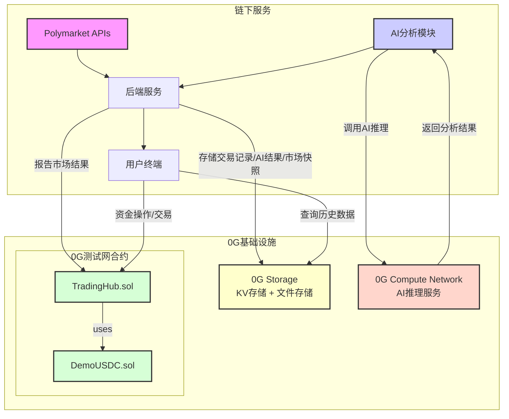

# 预测市场聚合交易终端 - 产品需求文档 (PRD)

| 文档版本 | 日期 | 作者 | 状态 |
| :--- | :--- | :--- | :--- |
| v1.0 | 2026-01-31 | Manus AI | 草稿 |
| v1.1 | 2026-01-31 | - | 草稿 - 新增0G Storage与0G Compute Network集成 |

## 1. 项目概述

### 1.1. 项目目标

本项目旨在开发一个基于0G测试网的预测市场聚合交易终端Demo。该产品将聚合来自Polymarket的预测事件数据，利用**0G Compute Network**的AI推理能力为用户提供决策辅助，通过**0G Storage**实现交易数据和AI分析结果的去中心化存证，同时在0G测试网上提供一个完整的、模拟的链上交易体验。产品核心是充分利用0G网络三大能力（**链上合约 + AI推理 + 去中心化存储**）的混合架构。

### 1.2. 核心功能

*   **市场浏览**: 从Polymarket API实时获取并展示活跃的预测市场事件。
*   **AI分析**: 对指定的市场事件，通过**0G Compute Network SDK**调用0G网络上的AI模型进行信源分析和结果预测。
*   **链上钱包**: 用户可在0G测试网上进行模拟USDC的充值和提现。
*   **模拟交易**: 用户可在0G测试网上对聚合来的Polymarket市场进行模拟下单、撮合和结算。
*   **去中心化存储**: 通过**0G Storage SDK**将用户交易记录、AI分析结果和市场快照数据持久化存储到0G去中心化存储网络，实现数据的不可篡改和可验证性。

### 1.3. 团队角色与分工

| 角色 | 负责人 | 主要职责 |
| :--- | :--- | :--- |
| **合约开发** | 成员A | 负责0G测试网上`DemoUSDC`和`TradingHub`智能合约的编写、测试和部署。 |
| **AI分析** | 成员B | 负责AI分析模块的开发，包括对接0G AI模型、设计Prompts和实现分析流程。 |
| **前端开发** | 成员C | 负责用户界面的开发，包括市场展示、AI结果呈现、钱包交互和交易操作。 |
| **后端开发** | 成员D | 负责Polymarket数据同步、作为预言机向链上报告结果，并为前端和AI模块提供API接口。 |

## 2. 系统架构



### 2.1. 0G能力使用全景

| 0G 能力 | 用途 | SDK / 工具 |
| :--- | :--- | :--- |
| **0G 测试网合约** | DemoUSDC + TradingHub 交易合约 | Ethers.js / Viem |
| **0G Compute Network** | AI分析模块调用AI推理模型 | `@0glabs/0g-serving-broker` |
| **0G Storage (KV)** | 用户交易记录、AI分析结果的结构化存证 | `@0glabs/0g-ts-sdk` KV模块 |
| **0G Storage (File)** | 市场快照、订单簿历史数据的文件存档 | `@0glabs/0g-ts-sdk` File模块 |

## 3. 用户故事 (User Stories)

*   **As a User**, I want to browse a list of active prediction markets from Polymarket, so that I can find interesting events to trade.
*   **As a User**, I want to view the detailed order book for a specific market, so that I can understand its liquidity and price distribution.
*   **As a User**, I want to request an AI analysis for a market, so that I can get an AI-powered prediction and confidence score to help my decision.
*   **As a User**, I want to connect my wallet to the platform, so that I can interact with the 0G testnet.
*   **As a User**, I want to get free test USDC and deposit it into the platform's trading contract, so that I can start trading.
*   **As a User**, I want to place a buy or sell order (limit order) on a specific market outcome, so that I can execute my trading strategy.
*   **As a User**, I want to see my open orders and have the ability to cancel them, so that I can manage my orders.
*   **As a User**, I want to see my current positions (holdings of outcome tokens) and my USDC balance, so that I can track my portfolio.
*   **As a User**, when a market I traded in is resolved, I want to be able to redeem my winning tokens for USDC, so that I can realize my profit.
*   **As a User**, I want to withdraw my USDC from the platform back to my wallet, so that I can control my funds.
*   **As a User**, I want my trade history to be stored on 0G decentralized storage, so that I have an immutable and verifiable record of all my transactions.
*   **As a User**, I want AI analysis results to be persisted on 0G Storage, so that I can review previous analyses without re-running them.

## 4. 开发规范

### 4.1. 智能合约开发 (负责人: 成员A)

#### 4.1.1. 技术栈

- **语言**: Solidity ^0.8.20
- **开发框架**: Hardhat / Foundry
- **标准**: ERC20, ERC1155
- **依赖库**: OpenZeppelin Contracts

#### 4.1.2. 合约 `DemoUSDC.sol`

这是一个标准的ERC20代币合约，用于模拟USDC。

- **标准**: ERC20
- **名称**: DemoUSDC
- **符号**: dUSDC
- **小数位**: 6

**接口定义:**

```solidity
interface IDemoUSDC {
    // 标准ERC20函数
    function totalSupply() external view returns (uint256);
    function balanceOf(address account) external view returns (uint256);
    function transfer(address recipient, uint256 amount) external returns (bool);
    function allowance(address owner, address spender) external view returns (uint256);
    function approve(address spender, uint256 amount) external returns (bool);
    function transferFrom(address sender, address recipient, uint256 amount) external returns (bool);

    // Demo功能：允许任何人铸造测试币
    function mint(address to, uint256 amount) external;
}
```

#### 4.1.3. 合约 `TradingHub.sol`

这是系统的核心交易合约，处理所有金融逻辑。它将同时实现ERC1155标准来代表市场的“结果代币”。

**核心数据结构:**

```solidity
struct Order {
    uint256 id;          // 订单ID
    address owner;       // 订单所有者
    uint256 price;       // 价格 (1-99)
    uint256 amount;      // 剩余未成交数量
}

// 使用mapping实现订单簿，更节省gas
// mapping(marketId => mapping(price => mapping(orderId => Order)))

// 用户USDC余额
mapping(address => uint256) public userBalances;

// 市场解析结果
// 0: 未解析, 1: NO胜, 2: YES胜
mapping(bytes32 => uint8) public marketResolutions;
```

**结果代币 (ERC1155):**

- `tokenId` 将通过 `keccak256(abi.encodePacked(marketId, outcome))` 动态计算。
- `outcome`: `0` 代表 `NO`, `1` 代表 `YES`。

**接口定义:**

```solidity
interface ITradingHub {
    // --- 资金管理 --- 
    event Deposit(address indexed user, uint256 amount);
    event Withdraw(address indexed user, uint256 amount);

    function deposit(uint256 amount) external;
    function withdraw(uint256 amount) external;

    // --- 交易核心 --- 
    event OrderPlaced(address indexed user, bytes32 indexed marketId, uint256 orderId, uint8 outcome, uint256 price, uint256 amount);
    event OrderCancelled(address indexed user, bytes32 indexed marketId, uint256 orderId);
    event OrderMatched(bytes32 indexed marketId, uint256 price, uint256 amount, address indexed buyer, address indexed seller);

    function placeOrder(bytes32 marketId, uint8 outcome, uint256 price, uint256 amount) external returns (uint256 orderId);
    function cancelOrder(uint256 orderId) external;

    // --- 市场解析与结算 --- 
    event MarketResolved(bytes32 indexed marketId, uint8 winningOutcome);
    event Redemption(address indexed user, bytes32 indexed marketId, uint256 amount);

    // 只有合约所有者（后端服务）可以调用
    function resolveMarket(bytes32 marketId, uint8 winningOutcome) external;
    function redeem(bytes32 marketId) external;

    // --- 视图函数 --- 
    function getOrder(uint256 orderId) external view returns (Order memory);
    function getUserBalance(address user) external view returns (uint256);
    // ... 其他用于前端展示订单簿的视图函数
}
```

### 4.2. 后端服务开发 (负责人: 成员D)

后端服务是连接Polymarket数据、AI模块、前端和链上合约的中心枢纽。

#### 4.2.1. 技术栈

- **语言**: Node.js (Express / Fastify)
- **Web3库**: Ethers.js v6
- **0G Storage SDK**: `@0glabs/0g-ts-sdk` (文件存储 + KV存储)
- **0G Compute SDK**: `@0glabs/0g-serving-broker` (AI推理调用)
- **数据库**: PostgreSQL / MongoDB (用于本地缓存和记录分析任务状态)

#### 4.2.2. 核心职责

1.  **数据同步**: 定时从Polymarket Gamma API拉取市场数据并缓存。
2.  **API网关**: 为前端提供统一的RESTful API接口，封装对Polymarket、AI模块、0G Storage和链上数据的访问。
3.  **预言机(Oracle)**: 监控Polymarket已解析的市场，并将结果安全地提交到`TradingHub.sol`合约。
4.  **数据存证**: 将AI分析结果、用户交易记录等关键数据通过0G Storage SDK写入去中心化存储网络。
5.  **市场快照**: 定时将市场数据和订单簿做快照，上传到0G文件存储作为历史存档。

#### 4.2.3. API接口定义

**Base URL**: `/api/v1`

**1. 获取市场列表**

- **Endpoint**: `GET /markets`
- **Description**: 从Polymarket获取并返回一个市场列表。
- **Query Params**:
    - `limit: int` (default: 20)
    - `offset: int` (default: 0)
    - `sortBy: string` (e.g., `volume`, `creationDate`, default: `volume`)
- **Success Response (200 OK)**:
    ```json
    {
        "data": [
            {
                "marketId": "0x...",
                "title": "Will Ethereum reach $5,000 by end of year?",
                "imageUrl": "https://...",
                "volume": 1250000.50,
                "endDate": "2026-12-31T23:59:59Z",
                "isResolved": false
            }
        ],
        "total": 150
    }
    ```

**2. 获取市场详情**

- **Endpoint**: `GET /markets/{marketId}`
- **Description**: 获取单个市场的详细信息，包括Polymarket的订单簿。
- **Path Params**: `marketId: string`
- **Success Response (200 OK)**:
    ```json
    {
        "marketId": "0x...",
        "title": "...",
        "description": "...",
        "resolutionSource": "https://...",
        "endDate": "...",
        "isResolved": false,
        "polymarketOrderBook": {
            "bids": [{"price": "55", "size": "1000"}],
            "asks": [{"price": "57", "size": "500"}]
        }
    }
    ```

**3. 请求AI分析**

- **Endpoint**: `POST /markets/{marketId}/analyze`
- **Description**: 为指定市场触发一个异步的AI分析任务。
- **Path Params**: `marketId: string`
- **Success Response (202 Accepted)**:
    ```json
    {
        "taskId": "a1b2c3d4-e5f6-7890-g1h2-i3j4k5l6m7n8"
    }
    ```

**4. 获取AI分析结果**

- **Endpoint**: `GET /analysis/{taskId}`
- **Description**: 根据任务ID查询AI分析的结果。
- **Path Params**: `taskId: string`
- **Success Response (200 OK)**:
    ```json
    {
        "taskId": "...",
        "status": "completed", // pending, processing, completed, failed
        "marketId": "0x...",
        "prediction": "YES", // YES, NO
        "confidence": 85, // 0-100
        "proArguments": [
            {"argument": "...", "confidence": 90},
            {"argument": "...", "confidence": 80}
        ],
        "conArguments": [
            {"argument": "...", "confidence": 60}
        ],
        "reasoning": "(Chain of Thought from LLM)..."
    }
    ```

**5. 获取用户交易历史 (从0G Storage)**

- **Endpoint**: `GET /trades/{userAddress}`
- **Description**: 从0G Storage KV存储中查询指定用户的交易记录。
- **Path Params**: `userAddress: string`
- **Query Params**:
    - `limit: int` (default: 50)
    - `offset: int` (default: 0)
- **Success Response (200 OK)**:
    ```json
    {
        "data": [
            {
                "orderId": "12345",
                "marketId": "0x...",
                "marketTitle": "...",
                "outcome": "YES",
                "price": 55,
                "amount": 100,
                "type": "buy",
                "status": "filled",
                "timestamp": "2026-01-31T12:00:00Z",
                "txHash": "0x...",
                "storageRootHash": "0x..."
            }
        ],
        "total": 30,
        "storageProvider": "0G Storage KV"
    }
    ```

**6. 获取市场快照历史 (从0G Storage)**

- **Endpoint**: `GET /markets/{marketId}/snapshots`
- **Description**: 获取指定市场的历史快照列表，数据存储在0G文件存储中。
- **Path Params**: `marketId: string`
- **Query Params**:
    - `limit: int` (default: 10)
- **Success Response (200 OK)**:
    ```json
    {
        "data": [
            {
                "snapshotId": "snapshot-1706702400",
                "timestamp": "2026-01-31T12:00:00Z",
                "rootHash": "0x...",
                "orderBookSummary": {
                    "bestBid": "55",
                    "bestAsk": "57",
                    "totalBidSize": "50000",
                    "totalAskSize": "30000"
                }
            }
        ]
    }
    ```

#### 4.2.4. 预言机(Oracle)逻辑

- 后端需要一个定时任务（如Cron Job），每5分钟执行一次。
- 任务逻辑：
    1.  从Polymarket的`/events`接口获取最近已关闭（`closed=true`）且活跃（`active=false`）的市场。
    2.  检查这些市场在`TradingHub.sol`合约中的状态是否仍为“未解析”。
    3.  如果一个市场在Polymarket上已解析，但在链上未解析，则调用`TradingHub.sol`的`resolveMarket(marketId, winningOutcome)`函数。
    4.  调用时必须使用一个拥有合约`owner`权限的安全钱包地址，并处理好nonce和gas。

### 4.3. AI分析模块开发 (负责人: 成员B)

AI分析模块集成在后端服务中（Node.js），通过**0G Compute Network SDK**调用0G网络上的AI推理服务，分析结果通过**0G Storage SDK**存证到去中心化存储。

#### 4.3.1. 技术栈

- **语言**: TypeScript (Node.js，与后端服务统一)
- **AI调用**: `@0glabs/0g-serving-broker` (0G Compute Network SDK) + `openai` 库 (兼容接口)
- **网页抓取**: `axios`, `cheerio`
- **0G存储**: `@0glabs/0g-ts-sdk` (分析结果存证)

#### 4.3.2. 0G Compute Network 初始化

```typescript
import { ethers } from "ethers";
import { createZGComputeNetworkBroker } from "@0glabs/0g-serving-broker";
import OpenAI from "openai";

// 初始化0G Compute Network Broker
const provider = new ethers.JsonRpcProvider("https://evmrpc-testnet.0g.ai");
const wallet = new ethers.Wallet(process.env.PRIVATE_KEY!, provider);
const broker = await createZGComputeNetworkBroker(wallet);

// 充值账户 (首次使用)
await broker.ledger.addLedger("0.1"); // 0.1 OG tokens

// 获取可用AI服务列表
const services = await broker.inference.listService();

// 选择AI服务提供商并确认
const providerAddress = "SELECTED_PROVIDER_ADDRESS";
await broker.inference.acknowledgeProviderSigner(providerAddress);

// 获取服务元数据 (endpoint和model)
const { endpoint, model } = await broker.inference.getServiceMetadata(providerAddress);
```

#### 4.3.3. 核心函数定义

```typescript
// ai-analyzer/index.ts

async function callOGAI(prompt: string): Promise<string> {
    // 每次请求需要生成新的headers (单次使用)
    const headers = await broker.inference.getRequestHeaders(providerAddress, prompt);

    const openai = new OpenAI({
        baseURL: endpoint,
        apiKey: "",
        defaultHeaders: headers,
    });

    const completion = await openai.chat.completions.create({
        messages: [{ role: "user", content: prompt }],
        model: model,
    });

    // 验证响应 (可选，用于可验证服务)
    const content = completion.choices[0].message.content!;
    await broker.inference.processResponse(providerAddress, content);

    return content;
}

function startAnalysisTask(marketInfo: MarketInfo): string {
    // 1. 生成任务ID，将任务状态初始化为 'pending' 并存入数据库
    // 2. 异步启动分析流程
    // 3. 立即返回任务ID
}

async function runAnalysis(taskId: string, marketInfo: MarketInfo): Promise<void> {
    // 1. 更新任务状态为 'processing'
    // 2. 步骤一：信源检索
    const articleText = await fetchAndCleanSource(marketInfo.resolutionSource);

    // 3. 步骤二：通过0G AI生成多角度论证
    const proArgs = await generateArguments(marketInfo, articleText, true);
    const conArgs = await generateArguments(marketInfo, articleText, false);

    // 4. 步骤三：通过0G AI综合判断
    const finalPrediction = await makeFinalPrediction(marketInfo, proArgs, conArgs);

    // 5. 将分析结果存入本地数据库
    // 6. 同时将分析结果存证到0G Storage KV
    await saveAnalysisToOGStorage(taskId, marketInfo.marketId, {
        proArgs, conArgs, finalPrediction
    });

    // 7. 更新任务状态为 'completed'
}
```

#### 4.3.3. Prompt设计 (关键！)

**1. 生成论据 (Pro/Con)**

```
System Prompt:
You are a professional prediction market analyst. Your goal is to provide clear, concise, and well-supported arguments based *only* on the provided source text. Do not use external knowledge.

User Prompt:
Based on the prediction market event and the source article below, generate exactly 3 independent arguments that support a 'YES' outcome. For each argument, provide a confidence score from 1 to 100.

Event Title: {market_info['title']}
Event Description: {market_info['description']}

Source Article Text:
---
{article_text}
---

Respond in JSON format: {"arguments": [{"argument": "...", "confidence": ...}]}}
```
*(生成反方论据时，将 'YES' 替换为 'NO')*

**2. 最终判断**

```
System Prompt:
You are a master prediction market decider. You will be given a set of pro and con arguments. Your task is to synthesize this information, perform a step-by-step reasoning process, and then make a final prediction (YES or NO) with an overall confidence score.

User Prompt:
Synthesize the following arguments to make a final prediction.

Event Title: {market_info['title']}

Pro Arguments:
- {pro_args[0]['argument']} (Confidence: {pro_args[0]['confidence']})
- {pro_args[1]['argument']} (Confidence: {pro_args[1]['confidence']})

Con Arguments:
- {con_args[0]['argument']} (Confidence: {con_args[0]['confidence']})
- {con_args[1]['argument']} (Confidence: {con_args[1]['confidence']})

First, provide your step-by-step reasoning (chain of thought). Then, provide the final answer in JSON format: {"prediction": "...", "confidence": ..., "reasoning": "..."}
```

#### 4.3.5. 与后端服务及0G Storage的交互

- AI分析模块作为后端服务的内部模块（同一Node.js进程），直接通过函数调用触发。
- 后端收到`POST /markets/{marketId}/analyze`请求后，调用`startAnalysisTask()`启动异步分析。
- AI模块通过0G Compute Network SDK调用AI推理服务，获取分析结果。
- 分析完成后，结果同时写入：
    1.  **本地数据库**（PostgreSQL/MongoDB）：用于快速查询和任务状态管理。
    2.  **0G Storage KV**：用于去中心化存证，保证数据不可篡改。
- 前端通过轮询`GET /analysis/{taskId}`获取分析状态和结果。

**0G Compute Network 使用注意事项:**
- 每次AI请求的headers是**单次使用**的，必须为每个请求重新生成。
- 调用前需先通过`acknowledgeProviderSigner`确认AI服务提供商。
- 需要预先通过`addLedger`充值OG代币作为AI调用费用。
- 如果某个Provider不响应，应遍历其他官方Provider进行重试。

### 4.4. 0G Storage 集成开发 (负责人: 成员D)

0G Storage模块负责将关键业务数据持久化到0G去中心化存储网络，提供数据的不可篡改性和可验证性。

#### 4.4.1. 技术栈

- **SDK**: `@0glabs/0g-ts-sdk`
- **依赖**: `ethers` v6
- **存储类型**: KV存储（结构化数据） + 文件存储（快照文件）

#### 4.4.2. 0G Storage 初始化

```typescript
import { ZgFile, Indexer, Batcher, KvClient } from '@0glabs/0g-ts-sdk';
import { ethers } from 'ethers';

// 网络常量
const RPC_URL = 'https://evmrpc-testnet.0g.ai/';
const INDEXER_RPC = 'https://indexer-storage-testnet-turbo.0g.ai';

// 初始化provider和signer
const provider = new ethers.JsonRpcProvider(RPC_URL);
const signer = new ethers.Wallet(process.env.STORAGE_PRIVATE_KEY!, provider);

// 初始化indexer
const indexer = new Indexer(INDEXER_RPC);
```

#### 4.4.3. KV存储 - 交易记录与AI分析结果

KV存储适用于频繁读写的结构化小数据。

**Key设计规范:**

| 数据类型 | Key格式 | Value内容 |
| :--- | :--- | :--- |
| 用户交易记录 | `trade:{userAddress}:{orderId}` | 交易详情JSON |
| AI分析结果 | `analysis:{marketId}:{taskId}` | 分析结果JSON |
| 市场索引 | `market_index:{marketId}` | 市场元信息JSON |

**写入示例:**

```typescript
async function saveTradeToOGStorage(
    streamId: string,
    userAddress: string,
    orderId: string,
    tradeData: TradeRecord
): Promise<void> {
    const [nodes, err] = await indexer.selectNodes(1);
    if (err !== null) throw new Error(`Node selection error: ${err}`);

    const batcher = new Batcher(1, nodes, flowContract, RPC_URL);
    const key = Uint8Array.from(Buffer.from(`trade:${userAddress}:${orderId}`, 'utf-8'));
    const value = Uint8Array.from(Buffer.from(JSON.stringify(tradeData), 'utf-8'));
    batcher.streamDataBuilder.set(streamId, key, value);

    const [tx, batchErr] = await batcher.exec();
    if (batchErr !== null) throw new Error(`Batch execution error: ${batchErr}`);
    console.log("Trade stored to 0G Storage. TX:", tx);
}

async function saveAnalysisToOGStorage(
    taskId: string,
    marketId: string,
    analysisResult: AnalysisResult
): Promise<void> {
    const [nodes, err] = await indexer.selectNodes(1);
    if (err !== null) throw new Error(`Node selection error: ${err}`);

    const batcher = new Batcher(1, nodes, flowContract, RPC_URL);
    const key = Uint8Array.from(Buffer.from(`analysis:${marketId}:${taskId}`, 'utf-8'));
    const value = Uint8Array.from(Buffer.from(JSON.stringify(analysisResult), 'utf-8'));
    batcher.streamDataBuilder.set(streamId, key, value);

    const [tx, batchErr] = await batcher.exec();
    if (batchErr !== null) throw new Error(`Batch execution error: ${batchErr}`);
}
```

**读取示例:**

```typescript
async function getTradeFromOGStorage(
    streamId: string,
    userAddress: string,
    orderId: string
): Promise<TradeRecord | null> {
    const kvClient = new KvClient(KV_NODE_RPC);
    const key = Uint8Array.from(Buffer.from(`trade:${userAddress}:${orderId}`, 'utf-8'));
    const value = await kvClient.getValue(streamId, ethers.encodeBase64(key));
    return value ? JSON.parse(Buffer.from(value, 'base64').toString('utf-8')) : null;
}
```

#### 4.4.4. 文件存储 - 市场快照

文件存储适用于较大的、不常变动的数据文件。

```typescript
import { Readable } from 'stream';

async function uploadMarketSnapshot(markets: MarketData[]): Promise<string> {
    const snapshot = JSON.stringify({
        timestamp: Date.now(),
        snapshotId: `snapshot-${Date.now()}`,
        markets: markets,
    });

    const stream = Readable.from(snapshot);
    const file = await ZgFile.fromStream(stream, `market-snapshot-${Date.now()}.json`);

    // 生成Merkle树用于验证
    const [tree, treeErr] = await file.merkleTree();
    if (treeErr !== null) throw new Error(`Merkle tree error: ${treeErr}`);

    const rootHash = tree?.rootHash();
    console.log("Snapshot Root Hash:", rootHash);

    // 上传到0G网络
    const [tx, uploadErr] = await indexer.upload(file, RPC_URL, signer);
    if (uploadErr !== null) throw new Error(`Upload error: ${uploadErr}`);

    await file.close();
    return rootHash!;
}

async function downloadMarketSnapshot(rootHash: string, outputPath: string): Promise<void> {
    const err = await indexer.download(rootHash, outputPath, true); // withProof = true
    if (err !== null) throw new Error(`Download error: ${err}`);
}
```

#### 4.4.5. 定时任务

| 任务 | 频率 | 描述 |
| :--- | :--- | :--- |
| 市场快照 | 每30分钟 | 将当前所有活跃市场数据和订单簿快照上传到0G文件存储 |
| 交易存证 | 实时 | 每笔链上交易确认后，将交易记录写入0G KV存储 |
| AI结果存证 | 完成时 | 每次AI分析完成后，将结果写入0G KV存储 |

### 4.5. 前端开发 (负责人: 成员C)

前端是用户与产品交互的唯一入口，需要提供清晰、流畅、响应迅速的体验。

#### 4.5.1. 技术栈

- **框架**: React (with Vite) 或 Vue.js
- **Web3库**: Ethers.js 或 Viem (推荐Viem，更现代、轻量)
- **UI库**: TailwindCSS (用于快速构建UI), Ant Design / Shadcn UI (组件库)
- **状态管理**: Redux Toolkit / Zustand (React) 或 Pinia (Vue)
- **数据请求**: `axios` 或 `react-query`

#### 4.5.2. 页面与核心组件

**1. 页面 (Pages)**

- **`/` (Home/Market List Page)**: 
    - 默认页面，展示从后端 `GET /markets` 获取的市场列表。
    - 支持分页、排序和筛选。
    - 每个市场项应简洁展示标题、图片、交易量，并有一个链接到详情页。
- **`/market/{marketId}` (Market Detail Page)**:
    - 页面核心，展示单个市场的详细信息。
    - **左侧**: 市场详情（标题、描述、结束时间）、Polymarket订单簿、链上订单簿（从`TradingHub`合约读取）。
    - **右侧**: 交易面板（下单组件）、AI分析面板。
- **`/portfolio` (Portfolio Page)**:
    - 展示用户的资产信息。
    - 显示链上USDC余额、`TradingHub`合约中的USDC余额。
    - 显示用户在各个市场的结果代币持仓（ERC1155余额）。
    - 显示用户在`TradingHub`中的所有活动订单，并提供取消功能。
    - 显示从0G Storage获取的用户历史交易记录（去中心化存证数据）。

**2. 核心组件 (Components)**

- **`Header`**: 
    - 包含Logo、导航链接（Markets, Portfolio）。
    - **`WalletConnectButton`**: 核心组件，处理连接钱包（如MetaMask）的逻辑。显示“Connect Wallet”或用户的地址和余额。
- **`MarketCard`**: 在列表页中展示单个市场的信息卡片。
- **`OrderBook`**: 可视化展示订单簿深度，区分Polymarket（参考）和链上（可交易）的订单。
- **`TradePanel`**: 
    - 允许用户选择“YES”或“NO”。
    - 输入价格（0-100）和数量（USDC）。
    - 计算并显示交易费用和潜在回报。
    - “Place Order”按钮会触发对`TradingHub.sol`合约的`placeOrder`函数调用。
- **`AIAnalysisPanel`**: 
    - 默认显示一个“Request AI Analysis”按钮。
    - 点击后，调用后端`POST /markets/{marketId}/analyze`，并进入轮询状态。
    - 轮询`GET /analysis/{taskId}`，直到状态变为`completed`或`failed`。
    - 成功后，清晰地展示预测结果（YES/NO）、置信度、正反方论据和思考过程。
- **`WalletActions`**:
    - 在Portfolio页面，提供`Mint dUSDC`, `Deposit to Hub`, `Withdraw from Hub`的功能按钮。
    - 每个按钮都会触发相应的合约调用。
- **`TradeHistory`**:
    - 展示用户的历史交易记录，数据从后端`GET /trades/{userAddress}`获取（底层来自0G Storage）。
    - 显示每笔交易的`storageRootHash`，用户可验证数据存证的真实性。

#### 4.5.3. 交互流程

- **连接钱包**: 用户点击`WalletConnectButton`，前端使用Ethers/Viem弹出MetaMask请求，获取用户地址和provider。
- **下单**: 用户在`TradePanel`中输入信息并点击下单，前端会：
    1.  准备对`TradingHub.sol`的`placeOrder`函数的调用参数。
    2.  估算Gas费用。
    3.  请求用户在MetaMask中签名并发送交易。
    4.  （可选）显示交易pending状态，并在交易确认后通知用户。
- **数据展示**: 
    - 市场列表、详情等非用户特定的数据，直接从后端API获取。
    - 用户余额、链上订单等用户特定的链上数据，通过Ethers/Viem直接调用`TradingHub.sol`的视图函数获取。
    - 定期（如每15秒）刷新链上数据和市场数据，以保持信息最新。

## 5. 环境变量配置

项目运行需要以下环境变量：

```bash
# .env 文件
# 0G 测试网
OG_RPC_URL=https://evmrpc-testnet.0g.ai/

# 0G Storage
OG_STORAGE_INDEXER_RPC=https://indexer-storage-testnet-turbo.0g.ai
STORAGE_PRIVATE_KEY=your_storage_wallet_private_key

# 0G Compute Network (AI推理)
COMPUTE_PRIVATE_KEY=your_compute_wallet_private_key

# 合约地址 (部署后填入)
DEMO_USDC_ADDRESS=0x...
TRADING_HUB_ADDRESS=0x...

# 0G Storage KV
OG_KV_STREAM_ID=your_stream_id
OG_KV_NODE_RPC=http://kv_node_address:6789

# Oracle钱包 (用于resolveMarket)
ORACLE_PRIVATE_KEY=your_oracle_wallet_private_key
```

## 6. 开发里程碑 (建议)

| 里程碑 | 周期 | 目标 | 产出物 |
| :--- | :--- | :--- | :--- |
| **M1: 核心架构搭建** | 1周 | - 合约开发完成并在测试网部署。<br>- 后端完成Polymarket数据同步和API框架。<br>- 0G Storage SDK和Compute SDK初始化集成。<br>- 前端完成钱包连接和基本页面路由。 | - 可交互的合约地址<br>- 可访问的后端API<br>- 0G Storage读写验证通过<br>- 0G AI推理调用验证通过<br>- 基础前端页面 |
| **M2: 功能实现** | 2周 | - 实现完整的充值、下单、取消、结算流程。<br>- AI分析模块通过0G Compute Network完成并与后端集成。<br>- 交易记录和AI结果通过0G Storage存证。<br>- 市场快照定时上传到0G文件存储。<br>- 前端完成所有核心组件和交互。 | - 可在测试网完成端到端交易<br>- 可在前端请求并查看AI分析结果<br>- 交易和分析数据可在0G Storage验证 |
| **M3: 测试与优化** | 1周 | - 进行全面的端到端测试。<br>- 验证0G Storage数据完整性和可检索性。<br>- 修复Bug，优化UI/UX。<br>- 撰写项目文档。 | - 稳定的Demo版本<br>- 完整的项目代码库和文档 |

## 7. 总结

本PRD详细定义了预测市场聚合交易终端Demo的产品需求、系统架构、以及各核心开发角色的具体技术规范和接口定义。项目充分利用了0G网络的三大核心能力：

1. **0G测试网智能合约** — DemoUSDC + TradingHub，提供链上交易和结算能力。
2. **0G Compute Network** — 通过`@0glabs/0g-serving-broker` SDK调用AI推理服务，为预测市场提供智能分析。
3. **0G Storage** — 通过`@0glabs/0g-ts-sdk`的KV存储和文件存储，实现交易记录、AI分析结果和市场快照的去中心化存证。

文档旨在为团队提供一份清晰、统一、可执行的开发蓝图，确保各模块能够高效协同工作，最终在0G测试网上成功交付一个功能完整、体验流畅的Demo产品。
